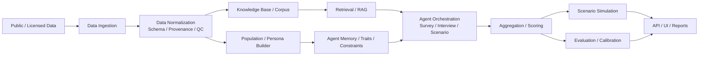
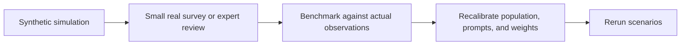
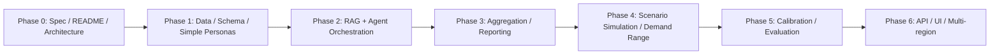

# Requirement Insight Agent

[](https://github.com/yoshisen/requirement-insight-agent)
[](https://github.com/yoshisen/requirement-insight-agent/tree/main)
[](https://github.com/yoshisen/requirement-insight-agent/commits/main)
[](https://github.com/yoshisen/requirement-insight-agent/issues)
[](https://www.apache.org/licenses/LICENSE-2.0)
[](https://github.com/yoshisen/requirement-insight-agent)
[](https://github.com/yoshisen/requirement-insight-agent)

> **会話から要件へ。**
>
> Requirement Insight Agent は、公開データ、RAG、分布整合的な合成消費者エージェントを組み合わせて、
> **市場要求の探索、需要仮説の形成、シナリオ評価、意思決定支援**を行うためのオープンソース基盤です。

Requirement Insight Agent は、人口統計、地域特性、消費傾向、商圏構造、商品カテゴリ知識などをもとに、
**population-aligned な synthetic consumer agents** を構築し、アンケート、模擬インタビュー、シナリオ評価を通じて、
**「この商品・この店・この価格・この販路戦略はどのように受け止められるか」**を定性的・定量的に探索するための research and decision-support framework です。

> [!IMPORTANT]
> このリポジトリは現在 **Spec-first / Under Active Design** の段階です。README は本番実装の説明というより、OSS としての設計意図、制約、評価観点、アーキテクチャ方針を共有するための仕様ドキュメントです。

## Project Status

| Item | Current |
| --- | --- |
| Status | Spec-first / Under Active Design |
| License | Apache License 2.0 |
| Default Branch | `main` |
| Primary Scope (Initial) | 日本・東京圏市場 |
| Initial Category Focus | スーパーにおける新商品上市・新規出店・販促・棚割り・需要仮説 |
| Positioning | Market research replacement ではなく、hypothesis generation / pre-evaluation / research design support |

## Highlights

- 公開データ、地域情報、カテゴリ知識を使って **population-aligned synthetic consumer agents** を構築する
- RAG を通じて、地域条件・カテゴリ条件・シナリオ条件に grounded なインタビューやアンケート実行を目指す
- 単一回答ではなく、**セグメント別反応・需要レンジ・不確実性** を含む出力設計を採用する
- 単一モデル依存を避けるため、**multi-model orchestration** と calibration を前提にする
- 東京圏のスーパー新商品上市を初期ユースケースとして、OSS として段階的に拡張する

## Quick Links

- [Project Overview](#1-プロジェクト概要)
- [Architecture](#7-基本アーキテクチャ)
- [Roadmap](#20-ロードマップ)
- [MVP](#19-mvp定義)
- [Example Scenario](#22-具体例東京圏のスーパー新商品上市)
- [Contributing](#24-コントリビューション)

<details>
<summary><strong>目次</strong></summary>

- [1. プロジェクト概要](#1-プロジェクト概要)
- [2. なぜ必要か](#2-なぜ必要か)
- [3. ビジョンと設計原則](#3-ビジョンと設計原則)
- [4. スコープ](#4-スコープ)
- [5. 非目標（Non-goals）](#5-非目標non-goals)
- [6. 想定ユースケース](#6-想定ユースケース)
- [7. 基本アーキテクチャ](#7-基本アーキテクチャ)
- [8. Synthetic Consumer Agent の定義](#8-synthetic-consumer-agent-の定義)
- [9. データソース方針](#9-データソース方針)
- [10. ペルソナ生成・母集団整合の考え方](#10-ペルソナ生成母集団整合の考え方)
- [11. マルチモデル対応方針](#11-マルチモデル対応方針)
- [12. RAG / Grounding戦略](#12-rag--grounding戦略)
- [13. 研究・実行ワークフロー](#13-研究実行ワークフロー)
- [14. 出力設計](#14-出力設計)
- [15. 評価と校正（Calibration）](#15-評価と校正calibration)
- [16. 倫理・安全性・プライバシー・コンプライアンス](#16-倫理安全性プライバシーコンプライアンス)
- [17. 限界と注意事項](#17-限界と注意事項)
- [18. リポジトリ構成案](#18-リポジトリ構成案)
- [19. MVP定義](#19-mvp定義)
- [20. ロードマップ](#20-ロードマップ)
- [21. Quick Start（予定）](#21-quick-start予定)
- [22. 具体例：東京圏のスーパー新商品上市](#22-具体例東京圏のスーパー新商品上市)
- [23. 想定出力例](#23-想定出力例)
- [24. コントリビューション](#24-コントリビューション)
- [25. オープンクエスチョン](#25-オープンクエスチョン)
- [26. 用語集](#26-用語集)

</details>

---

## 1. プロジェクト概要

### Requirement Insight Agent とは何か

Requirement Insight Agent は、**市場要求（requirement）や潜在ニーズ、購買障壁、価格感度、カテゴリ受容性、商圏適合性**を探索するための、
オープンソースの **AI エージェント研究・意思決定支援プラットフォーム**です。

本プロジェクトは以下を組み合わせます。

- 公開統計データ
- 地域・商圏・地理情報
- 商品カテゴリ知識
- 公開 Web 情報
- 適法かつ契約上問題のないアンケートや調査データ
- RAG（Retrieval-Augmented Generation）
- マルチ LLM 実行基盤
- 合成エージェント生成
- 集約・評価・シナリオ分析

これにより、企業・研究者・プロダクトチーム・小売事業者が、
**「実際に市場投入する前に、どのような要求や反応が生じるか」**を構造的に検討できることを目指します。

### このプロジェクトが解く問題

現実の市場調査には、以下の課題があります。

- 調査設計に時間がかかる
- インタビュー対象の募集コストが高い
- サンプル数が不足しやすい
- 仮説が曖昧なまま調査が始まりやすい
- 新商品や新業態について、初期段階で広く比較検討しにくい
- 地域差・生活様式差・価格感受性差を十分に考慮しにくい

Requirement Insight Agent は、これらに対し、まず **仮説生成・論点整理・比較検討のための合成的な研究環境** を提供します。

### “Requirement Insight” が重要な理由

市場ではしばしば「何を売るか」以前に、
**誰に、どの文脈で、何が必要とされているのか** が不明確なまま企画が始まります。

本プロジェクトが狙うのは、単なる満足度測定や自由回答要約ではなく、次を **シナリオと根拠付きで可視化すること** です。

- 何が要求されているのか
- なぜ要求されるのか
- 何が購買を妨げるのか
- どの層に受け入れられやすいのか
- 価格・販路・訴求で何が変わるのか
- 実際の導入前にどこが不確実か

### “Synthetic Market Agents” とは何か

本プロジェクトで扱うエージェントは、**synthetic consumer agents（合成消費者エージェント）**です。

これらは次を意味します。

- 実在人物ではない
- 特定個人の複製ではない
- デジタルツインではない
- 実在個人の再構成を目的としない
- 集計的な分布・地域特性・消費傾向をもとに構成される
- 市場仮説の検討に使う研究用シミュレーション主体である

**The agents in this project are synthetic consumer agents. They do not represent real individuals, and the system must not be used to reconstruct, imitate, or profile actual persons.**

## 2. なぜ必要か

### 既存のアンケートだけでは足りない理由

従来型のアンケートや定量調査は重要ですが、初期仮説形成の段階では以下の問題があります。

- 問いの立て方自体が未成熟
- 調査票設計の前提条件が不足
- 何を比較すべきか分からない
- 新カテゴリ・新業態では既存選択肢が通用しにくい
- 小さな企画段階では十分な予算がない

そこで、本プロジェクトは、**人間調査の前段階に探索的な synthetic population-based simulation を差し込む**ことを狙います。

### なぜエージェントベースのシミュレーションが有効か

エージェントベースのアプローチは、単一の平均的顧客像ではなく、以下のような**異質な反応の分布**を扱いやすい、という利点があります。

- 価格敏感な層
- 利便性重視の層
- まとめ買い志向の層
- トレンド追随層
- ブランド保守層
- 地域依存の高い層
- EC 中心生活者
- 実店舗中心生活者

ただし、本プロジェクトはそれを「正解生成装置」として扱いません。
あくまで **仮説の幅を広げるための構造化された下調べ** として設計します。

### なぜ grounding と calibration が必要か

LLM だけで“性格の違う 1000 人”を作っても、それは **ただのばらばらな会話生成** になりがちです。

そのため、本プロジェクトでは以下を重視します。

- **Grounding**: 公開統計・地域知識・カテゴリ知識に基づく根拠づけ
- **Calibration**: 実データ・分布・既知の傾向への整合
- **Representativeness**: 人口・世帯・地域・チャネル行動の偏り管理
- **Uncertainty**: よく分からない部分を明示すること

## 3. ビジョンと設計原則

### 3.1 Population-aligned Simulation

エージェントは“面白いキャラクター”ではなく、
**対象市場の分布と構造に整合する synthetic respondents** であるべきです。

### 3.2 Explainability

各エージェントや集約結果は、可能な限り以下を持つべきです。

- どの前提に基づくか
- どの知識源に支えられているか
- どの属性が反応に影響したか
- どこに不確実性があるか

### 3.3 Modularity

以下の各層は疎結合で交換可能であるべきです。

- データ取得
- RAG
- モデルプロバイダ
- エージェント生成
- 実行オーケストレーション
- 集約・評価
- UI / API

### 3.4 Reproducibility

シード、モデル設定、プロンプトバージョン、データ版、集約設定を保存し、
**同じ条件で再実行できる**設計を目指します。

### 3.5 Privacy and Ethics

**All data used to build or ground synthetic agents must be lawful, privacy-preserving, license-compliant, and auditable. Public data must not be interpreted as permission for invasive personal reconstruction.**

### 3.6 Region-aware Reasoning

市場反応は地域差が大きいため、以下を考慮した**地域条件付き推論**を重視します。

- 居住地
- 商圏
- 通勤圏
- 競合店舗密度
- 公共交通アクセス
- 世帯構成
- 地域価格帯

### 3.7 Human-in-the-loop

最終判断を人間から切り離しません。
このシステムは、人が問いを磨き、仮説を比較し、検証観点を増やすためのものです。

## 4. スコープ

### 初期スコープ

- **地域:** 日本の東京圏（Greater Tokyo Area）
- **初期用途:** スーパーの新商品上市、新規出店、需要仮説、販促施策、棚割り・在庫仮説
- **初期手法:** synthetic population + RAG + multi-agent interviewing + aggregation + scenario estimation

### 対象カテゴリ（拡張可能）

- 食品・飲料
- 日用品・生活雑貨
- 衣料
- 家具・インテリア
- 家電
- 自動車・モビリティ
- EC サービス
- 小売・地域サービス
- 住まい関連
- ライフスタイル商材全般

### 将来的な拡張

- 日本全国への拡張
- 他国 / 他都市圏対応
- B2C 以外の需要探索
- 実データとの連携強化
- ダッシュボード / 対話型 UI
- 履歴ベースの継続学習
- ベンチマーク対応

## 5. 非目標（Non-goals）

本プロジェクトの非目標を明確にします。

- 実際の人間インタビューや市場調査の完全代替
- 保証された需要予測
- 財務成果の確定的予言
- 実在個人の再構成・模倣・プロファイリング
- 政治的説得や世論操作
- 脆弱な層のターゲティングや搾取
- 違法・不透明なスクレイピング基盤
- 「1000 人の本物の消費者」を再現したと主張すること

**Requirement Insight Agent is a research and decision-support framework for requirement discovery and market simulation. It is designed to generate hypotheses, compare scenarios, and support exploration, not to provide guaranteed business outcomes.**

## 6. 想定ユースケース

### 6.1 新商品上市前評価

例:

- 東京圏のスーパーで新しい惣菜・冷凍食品・飲料を出すべきか
- どの世帯層に刺さりそうか
- 価格をどこまで許容するか
- 既存品からの置換か、新規需要か

### 6.2 新規出店評価

例:

- 新しいスーパーをある地域に開くとき、どのような客層が反応しそうか
- 実店舗優位か、EC 併用が必要か
- 競合密度と地域生活導線を考慮した訴求は何か

### 6.3 EC 立ち上げ評価

例:

- 新しい EC サービスの利用意向
- 購入カテゴリごとのオンライン適性
- リピートにつながる UX 要素
- 配送料・即日配送・ポイント設計の影響

### 6.4 価格テスト・販促テスト

例:

- 価格差による受容性変化
- クーポン / 特売 / まとめ買いの効き方
- ブランド訴求 vs 価格訴求の違い

### 6.5 品揃え・棚割り・簡易需要仮説

例:

- 新商品導入時の品揃え優先度
- どのカテゴリに強く受け入れられそうか
- 在庫仮説の保守・中位・楽観ケース

### 6.6 実調査前の論点整理

例:

- 本番のアンケートで何を聞くべきか
- どのセグメントを深掘りすべきか
- どの仮説が最も未検証か

## 7. 基本アーキテクチャ

以下は初期の高水準アーキテクチャです。GitHub README で読みやすいよう、層の役割を中心に簡略化しています。



### 7.1 Data Ingestion Layer

- 公開統計
- 地図 / 地域 / 商圏データ
- 商品・価格データ
- 合法的な公開 Web 情報
- ライセンス済み調査データ
- ユーザー保有の内部データ（任意）

### 7.2 Data Normalization Layer

- スキーマ統一
- 欠損処理
- 地域単位の正規化
- 時点管理
- ライセンス / 出所追跡
- 品質スコア付与

### 7.3 Knowledge Base / Corpus Layer

- ドキュメント本文
- 構造化属性
- タグ（地域 / カテゴリ / 時点 / 典拠）
- Embedding / index
- Citation metadata

### 7.4 Persona Generation Engine

- 対象母集団分布の定義
- プロファイル骨格生成
- 行動傾向の初期値設定
- 地域・カテゴリ条件の付加
- 不確実性ラベル設定

### 7.5 Agent Orchestration Layer

- 1 対 1 模擬インタビュー
- アンケート実行
- 反実仮想シナリオ評価
- モデルプロバイダ切替
- バッチ処理 / 再試行
- ガードレール適用

### 7.6 Aggregation Engine

- セグメント別集約
- 購買意向スコア
- 主要反対理由抽出
- 価格帯別反応
- チャネル嗜好
- 説明付き要約
- 不確実性・分散評価

### 7.7 Demand Estimation Layer

- 需要“予測”ではなく、需要シナリオ推定を行う
- ケース別レンジを出力する
- 誤差要因を提示する
- 前提条件ごとの差分を可視化する

### 7.8 Evaluation & Monitoring Layer

- 再現性
- 出力安定性
- 外部比較
- ベンチマーク
- 校正
- バイアス確認
- エージェント多様性監視

## 8. Synthetic Consumer Agent の定義

### 8.1 基本定義

Synthetic Consumer Agent とは、対象市場における分布・属性・制約・行動傾向・知識コンテキストに整合するよう構成された、合成的な消費者表現体です。

これはキャラクター生成ではなく、統計・地域・行動仮説に基づく研究用モデル単位です。

### 8.2 参考スキーマ（概念モデル）

各エージェントは、少なくとも以下の属性を持つことを想定します。

#### 基本属性

- `agent_id`
- `region`
- `catchment_area`
- `household_composition`
- `age_band`
- `life_stage`
- `income_band`
- `education_band`（必要に応じて）
- `occupation_style`
- `work_pattern`
- `mobility_pattern`
- `commuting_style`

#### 消費・購買属性

- `channel_preference`（実店舗 / EC / ハイブリッド）
- `price_sensitivity`
- `brand_loyalty_tendency`
- `novelty_seeking`
- `basket_size_tendency`
- `impulse_purchase_tendency`
- `planning_tendency`
- `shopping_mission_types`
- `category_preferences`
- `category_aversions`
- `promotion_responsiveness`
- `frequency_of_purchase_by_category`

#### 価値観・志向（抽象レベル）

- `convenience_orientation`
- `health_orientation`
- `eco_orientation`
- `quality_orientation`
- `status_orientation`（必要性がある場合に限定）
- `risk_aversion`
- `digital_literacy`
- `worldview_tags`（抽象的・安全な範囲に限定）

#### 制約と文脈

- `budget_constraints`
- `time_constraints`
- `household_needs`
- `access_constraints`
- `storage_constraints`
- `local_competition_context`

#### 推論関連

- `rationale_memory`
- `grounding_context_refs`
- `uncertainty_profile`
- `response_style`
- `explanation_trace`

### 8.3 重要な原則

これらの属性は、実在個人の属性そのものではなく、**分布整合的な synthetic representation** として扱います。

- 実在個人の再特定は禁止
- 個人単位のコピー禁止
- SNS 等からの人格復元禁止
- 特定人物の模倣禁止
- 差別・偏見を強化する表現禁止

## 9. データソース方針

以下を許可・推奨されるデータソース類型として扱います。

### 9.1 公開統計・公的データ

- 人口統計
- 世帯構成
- 年齢分布
- 収入帯分布
- 就業・通勤データ
- 家計調査
- 地域経済指標
- 物価や消費関連指標

### 9.2 地理・商圏・地図データ

- 行政区画
- 駅・交通網
- POI（Point of Interest）
- 店舗密度
- 商業集積
- 移動容易性
- エリア特性

### 9.3 商品・価格・カタログ系データ

- 公開商品情報
- 価格帯情報
- カテゴリ構造
- 競合比較情報
- 一般公開の販促情報

### 9.4 公開 Web 情報

- 企業公開情報
- ニュース・プレスリリース
- 公開レビューの集計的シグナル
- トレンド情報
- 公開されている地域・生活情報

ただし、違法・不透明・過剰なスクレイピングや、個人再構成につながる収集は対象外です。

### 9.5 調査・アンケートデータ

- ライセンス済みの外部調査
- 利用許諾のあるユーザー保有データ
- 自社調査結果
- 公開レポートの集計値

### 9.6 参考アーキタイプデータ

- 既知の行動類型
- 小売 / カテゴリ別の一般的傾向
- フィクションや物語は、著作権侵害にならない抽象的アーキタイプの着想源としてのみ利用可能

### 9.7 データ利用ポリシー

- 適法であること
- ライセンス準拠であること
- 出所追跡可能であること
- 更新頻度を管理すること
- 品質と偏りを明示すること
- 個人情報の侵害につながらないこと
- 集約・匿名・安全化された利用を基本とすること

### 9.8 SNS・ソーシャルデータについて

SNS 等の公開データは、扱いを慎重に限定します。

- 合法であること
- 利用規約に反しないこと
- 個人再構成をしないこと
- 集約レベル・傾向レベルで扱うこと
- 脆弱層操作やセンシティブ推定に用いないこと

### 9.9 ライセンス、鮮度、品質

各データセットには最低限以下のメタ情報を持たせます。

- `source_name`
- `source_url`
- `license_type`
- `retrieved_at`
- `coverage_region`
- `coverage_time`
- `quality_score`
- `known_biases`
- `allowed_use`

## 10. ペルソナ生成・母集団整合の考え方

### 10.1 目標

約 1000 体規模の synthetic consumer agents を、対象市場の分布に整合するように構築することを目標とします。

ただし実装初期は 50〜100 体規模の MVP から開始し、段階的に拡張します。

### 10.2 生成フロー（概念）

1. 対象地域・対象カテゴリを定義する
2. 目標母集団分布を定義する
3. 分布に基づいてプロファイル骨格をサンプリングする
4. 地域特性・商圏文脈を付与する
5. カテゴリ・商品知識を RAG で関連付ける
6. 購買傾向・制約・反応スタイルを合成する
7. 不確実性ラベルを設定する
8. ベンチマークに照らして再調整する
9. 多様性と偏りを評価する
10. シナリオ別に有効性を確認する

### 10.3 セグメント設計の例

- 単身 / 夫婦 / 子育て / 高齢世帯
- 低〜高収入帯
- 東京中心部 / 郊外 / ベッドタウン
- 実店舗重視 / EC 重視 / ハイブリッド
- 節約志向 / 品質志向 / 健康志向 / 利便性志向
- ブランド追随 / 価格追随 / トレンド追随 / 慣性購買

### 10.4 重要: Calibration（校正）

1000 エージェントを生成しても、それだけでは意味がありません。
本プロジェクトは必ず **校正（calibration）** を前提とします。

校正対象の例:

- 年齢帯分布
- 世帯構成比
- 地域別生活スタイル
- チャネル利用傾向
- 一般的カテゴリ購買特性
- 既知の需要傾向
- 公的統計や既存調査との整合度

### 10.5 Latent Preference Modeling（潜在嗜好）

必要に応じて、明示属性だけでなく以下を導入します。

- 価格感度の潜在軸
- 新規性受容性
- 習慣性購買度
- 時間価値感
- ブランド切替抵抗
- 商圏外移動許容度

ただし、解釈不能なブラックボックス表現は避け、できる限り説明可能性を維持します。

## 11. マルチモデル対応方針

Requirement Insight Agent は、単一モデル依存を避けるため、複数のモデルプロバイダに対応可能な抽象化層を持つことを目指します。

### 11.1 対応候補

- OpenAI / ChatGPT
- Gemini
- Claude
- ローカル / オープンソース LLM

### 11.2 必要な抽象化

- Provider abstraction
- Model routing
- Cost policy
- Tool-calling capability abstraction
- Retry / fallback
- Deterministic mode
- Stochastic mode
- Prompt template versioning
- Safety layer

### 11.3 モード例

#### Deterministic Mode

- 比較実験
- 再現性重視
- テスト用途

#### Exploratory Mode

- 多様な反応探索
- アイデア比較
- 仮説生成用途

### 11.4 プロバイダ比較で評価すべき点

- 一貫性
- 多様性
- Grounding への従順性
- Hallucination 耐性
- コスト
- 応答速度
- 長文文脈能力
- JSON 構造出力安定性

## 12. RAG / Grounding戦略

### 12.1 何を index するか

- 地域情報
- 商圏情報
- カテゴリ知識
- 商品仕様
- 競合比較
- 公開統計要約
- 家計 / 消費関連知識
- 利用可能な公開レポート断片
- ユーザー指定資料
- 過去調査結果（利用許諾がある場合）

### 12.2 Retrieval 戦略

- 地域条件で絞る
- カテゴリ条件で絞る
- シナリオ条件で絞る
- 時点条件で絞る
- エージェント属性条件で絞る
- Citation metadata を保持する

### 12.3 Grounding 制約

各エージェント応答は、可能な限り以下の原則で生成されるべきです。

- 利用可能な根拠文脈に依存する
- 根拠のない断定を避ける
- 「分からない」を許容する
- 地域 / カテゴリ条件を逸脱しない
- 属性外の無根拠な性格づけを避ける
- 典拠を explanation trace に残す

### 12.4 Hallucination を抑えるための考え方

- 根拠がないときは保留する
- 推定であることを明記する
- 不確実性を数値または段階で表示する
- 実証が必要な論点を分離する
- Agent 側の“思いつき”を集約前に検査する

## 13. 研究・実行ワークフロー

本プロジェクトの標準ワークフローは以下を想定します。

1. ビジネス課題を定義する
2. 地域・カテゴリ・比較対象を定義する
3. データソースを選定・ロードする
4. Synthetic population を生成または選択する
5. アンケート / インタビュー / シナリオ質問を設計する
6. エージェント群に対して実行する
7. セグメント別に集約する
8. 定性的示唆・定量レンジ・異論・不確実性を整理する
9. 必要に応じて需要レンジ・在庫レンジをシナリオ提示する
10. 実データや小規模実調査と照合する
11. プロンプト・分布・重み・知識ベースを修正して再実行する

例: 東京圏で新しい冷凍惣菜をスーパーに導入すべきか。

### 13.1 実世界検証の閉ループ

本プロジェクトは、シミュレーションで完結しないことを重視します。



## 14. 出力設計

出力は、単なる Yes / No 判定ではなく、多層的であるべきです。

### 14.1 定性的出力

- 刺さる理由
- 刺さらない理由
- 購買障壁
- 利用シーン
- 代替品 / 競合先
- 想定される懸念
- カテゴリ別受容理由

### 14.2 セグメント別出力

- 年齢帯別
- 世帯構成別
- 所得帯別
- 地域別
- チャネル嗜好別
- 価格感度別
- ライフスタイル別

### 14.3 定量寄り出力

- 購買関心度（推定）
- 価格受容帯
- チャネル別利用意向
- 商品認知・試用・継続利用の段階推定
- 比較案に対する選好比率

### 14.4 シナリオ出力

- 保守ケース
- 中位ケース
- 楽観ケース
- 条件変更時の差分

### 14.5 在庫・需要に関する出力

**Demand and inventory outputs are scenario-based estimates with uncertainty, not deterministic prescriptions.**

たとえば単一の数値ではなく、以下のように出力します。

| ケース | 推定レンジ |
| --- | --- |
| 保守ケース | 600-800 |
| 中位ケース | 900-1200 |
| 楽観ケース | 1300-1700 |

併せて、以下も示します。

- どの仮説が前提か
- どのセグメントで意見が割れているか
- どのデータが不足しているか
- どの前提で需要が変動するか

### 14.6 重要な立場

Outputs from this system should be treated as structured simulation results and hypothesis-support signals. They should be reviewed alongside real market data, user research, and domain expertise before any operational decision is made.

## 15. 評価と校正（Calibration）

本プロジェクトで最も重要なセクションの一つです。

### 15.1 評価の観点

| 観点 | 内容 |
| --- | --- |
| Historical Backtesting | 過去事例に対して、どの程度一貫した示唆が出るか |
| Agreement with Real Survey Data | 実際のアンケートやインタビューとの方向的一致 |
| Run-to-run Stability | 同条件での安定性 |
| Calibration Quality | 集計分布への整合性 |
| Bias Checks | 特定層への不当な偏りの有無 |
| Representativeness Checks | 母集団対比での不足・過剰 |
| Provider Comparison | モデル差によるブレ |
| Ablation Studies | RAG や属性情報を外した場合の差 |
| Human Review | ドメイン専門家レビュー |
| Outcome Tracking | 実施後データとの比較 |

### 15.2 校正（Calibration）の実際

校正では、たとえば以下の整合性を見ます。

- 人口・世帯分布
- 購買チャネル傾向
- 生活導線
- 商品カテゴリ反応の一般傾向
- 価格耐性分布
- 実調査とのズレ

### 15.3 不確実性の扱い

不確実性は“誤差”ではなく、出力の一部として扱います。

不確実性が高まる要因:

- データ鮮度不足
- 地域粒度不足
- カテゴリ新規性
- 商品情報不足
- RAG 根拠不足
- モデル間不一致
- セグメント内の意見分散

表示例:

- `low / medium / high uncertainty`
- 信頼区間風のレンジ
- 異論比率
- 説明不能な分岐の明示

## 16. 倫理・安全性・プライバシー・コンプライアンス

このプロジェクトでは、性能よりも先に、適法性・監査可能性・安全性を重視します。

### 16.1 基本方針

- Synthetic agents は実在人物ではない
- 実在個人の再構成をしない
- プライバシー侵害的なデータ利用をしない
- 利用規約・著作権・ライセンスを尊重する
- 差別や有害な固定観念を強化しない
- 脆弱層の搾取・操作に使わない
- 出力に限界を明示する
- 監査可能性を維持する

### 16.2 してはいけないこと

- 実在個人の模倣
- 個人プロファイリング
- 個人ターゲティングの精密化
- 差別的属性推定
- 違法スクレイピング
- センシティブ属性による有害な最適化
- 「AI がこの人たちを完全再現した」と主張すること

### 16.3 このプロジェクトの立場

This project is a research and decision-support system, a simulation and hypothesis-generation framework, not a replacement for real market research, not a source of guaranteed financial outcomes, and not a system for profiling or targeting real individuals.

## 17. 限界と注意事項

本プロジェクトには明確な限界があります。

### 17.1 限界

- Synthetic agents は現実の複雑さを完全には表現できない
- 新奇カテゴリでは特に不確実性が高い
- 実際の購買行動は天候・景気・競合・在庫・口コミなどで大きく変動する
- エージェント回答は“会話としてもっともらしい”だけでは価値がない
- Calibration に失敗すると、出力は単なる物語になる
- モデルプロバイダ差で結果が揺れる可能性がある

### 17.2 利用上の注意

- 最終的な商品投入判断をこれだけで行わない
- 実調査・小規模実験・実売データと組み合わせる
- 高リスクな投資判断に単独利用しない
- 利用データの出所と許諾を確認する
- 出力を「意思決定支援シグナル」として解釈する

## 18. リポジトリ構成案

以下は初期の推奨構成です。

```text
requirement-insight-agent/
├─ README.md
├─ LICENSE
├─ docs/
│  ├─ architecture.md
│  ├─ safety.md
│  ├─ data-policy.md
│  ├─ evaluation.md
│  └─ roadmap.md
├─ configs/
│  ├─ models/
│  ├─ pipelines/
│  └─ scenarios/
├─ schemas/
│  ├─ agent.schema.json
│  ├─ datasource.schema.json
│  ├─ scenario.schema.json
│  └─ output.schema.json
├─ data/
│  ├─ raw/
│  ├─ processed/
│  └─ sample/
├─ ingestion/
│  ├─ public_stats/
│  ├─ geo/
│  ├─ retail/
│  └─ surveys/
├─ rag/
│  ├─ indexing/
│  ├─ retrieval/
│  └─ grounding/
├─ agents/
│  ├─ builders/
│  ├─ profiles/
│  ├─ memory/
│  └─ orchestration/
├─ prompts/
│  ├─ interview/
│  ├─ survey/
│  ├─ aggregation/
│  └─ calibration/
├─ simulations/
│  ├─ market/
│  ├─ demand/
│  └─ inventory/
├─ evaluation/
│  ├─ benchmarks/
│  ├─ backtests/
│  └─ bias_checks/
├─ api/
├─ ui/
├─ examples/
│  ├─ tokyo-supermarket-launch/
│  └─ new-ec-service/
└─ tests/
```

### 18.1 ディレクトリ説明

| Directory | Purpose |
| --- | --- |
| `docs/` | 設計思想、アーキテクチャ、安全性方針、評価方針 |
| `configs/` | モデル設定、実行パイプライン、シナリオ設定 |
| `schemas/` | エージェント・データソース・出力に関する仕様 |
| `data/` | サンプルデータ、処理済みデータ、開発用データ |
| `ingestion/` | データ取得コネクタ群 |
| `rag/` | Index、retrieval、grounding を管理 |
| `agents/` | エージェント生成、記憶、制約、オーケストレーション |
| `prompts/` | 面談・アンケート・集約・校正用プロンプトテンプレート |
| `simulations/` | 需要シナリオや比較実験 |
| `evaluation/` | バックテスト、バイアス点検、安定性評価 |
| `api/`, `ui/` | 将来の利用インターフェース |
| `examples/` | 再現しやすいサンプルケース |
| `tests/` | 単体 / 統合テスト |

## 19. MVP定義

最初から 1000 エージェント・全カテゴリ・全地域をやるのではなく、東京圏 × スーパー新商品に絞った MVP を定義します。

### 19.1 MVP で含めるもの

- 1 地域: 東京圏
- 1 カテゴリ: スーパー新商品
- 1 population build pipeline
- 1 RAG pipeline
- 1 インタビュー / アンケート実行器
- 1 集約モジュール
- 1 需要シナリオ推定モジュール
- 小規模な評価ワークフロー

### 19.2 MVP で含めないもの

- フル UI
- 完全な自動データ収集
- 多地域最適化
- 高度な時系列予測
- 大規模本番向け推論最適化

## 20. ロードマップ



**Current focus:** Phase 0

### 20.1 Phase 0: Spec / README / Architecture

- README 整備
- アーキテクチャ定義
- リスクと方針の明文化

### 20.2 Phase 1: Data / Schema / Simple Personas

- データソース一覧
- 基本スキーマ
- 少数エージェントでの検証

### 20.3 Phase 2: RAG + Agent Orchestration

- Grounding
- Interview / survey 実行
- Citation trace

### 20.4 Phase 3: Aggregation / Reporting

- 分層集約
- 報告フォーマット
- 不確実性表示

### 20.5 Phase 4: Scenario Simulation / Demand Range

- ケース比較
- 需要レンジ
- 条件感度分析

### 20.6 Phase 5: Calibration / Evaluation

- 実データ比較
- 再現性評価
- バイアス確認

### 20.7 Phase 6: API / UI / Multi-region

- UI
- API
- 他地域対応
- モデルプロバイダ拡張

## 21. Quick Start（予定）

現時点では仕様先行の設計フェーズです。以下は **予定コマンド** です。

> [!NOTE]
> 下記は将来の想定フローを示すものであり、現時点の実装保証ではありません。コマンド例は POSIX shell を前提としています。

```bash
git clone https://github.com/yoshisen/requirement-insight-agent.git
cd requirement-insight-agent

# create env
cp .env.example .env

# install
make install

# ingest sample data
make ingest-sample

# build sample synthetic population
make build-population

# run sample scenario
make run-example TOKYO_SUPERMARKET_LAUNCH

# generate report
make report-example
```

## 22. 具体例：東京圏のスーパー新商品上市

### 22.1 問い

「東京圏のスーパーで、新しい高たんぱく低糖質の冷凍惣菜シリーズを出すべきか？」

### 22.2 入力例

- 対象地域: 東京圏
- チャネル: スーパー中心
- 価格案: 398 円 / 498 円 / 598 円
- 想定ターゲット: 単身・共働き・健康志向層
- 比較対象: 既存冷凍惣菜、コンビニ総菜、宅食サービス

### 22.3 調べたいこと

- どの層に刺さるか
- 高価格許容はどこまでか
- 健康訴求と時短訴求のどちらが強いか
- 既存需要の置換か新規需要か
- EC 相性はあるか
- 導入店舗でどれくらいの需要レンジが想定されるか

### 22.4 実行イメージ

1. 関連地域 / カテゴリデータを取り込む
2. Synthetic population をロードする
3. 商品概要を RAG に渡す
4. アンケートとインタビューを実行する
5. 集約・比較・不確実性分析を行う
6. 需要レンジをケース別に出す
7. 実調査で検証すべき論点を抽出する

## 23. 想定出力例

これはあくまで例であり、実際の出力形式・数値ではありません。

### 23.1 総合所見

- 健康訴求単独よりも、「高たんぱく + 短時間調理 + 夜食 / 在宅勤務相性」の組み合わせで反応が向上
- 単身 / 共働き層で受容性が高い一方、価格感度の高い世帯では継続利用に懸念
- 郊外ファミリー層では容量・コスパ訴求に改良余地

### 23.2 セグメント別示唆

- 20〜30 代単身: 試用意向高め、継続は価格次第
- 共働き子育て層: 興味あり、ただし量・家族適合が課題
- 高齢層: 健康訴求は有効だが冷凍惣菜習慣の差が大きい

### 23.3 価格感度

- 398 円: 試用ハードルが低い
- 498 円: 商品理解が進めば許容余地あり
- 598 円: 一部層以外では継続障壁

### 23.4 需要シナリオ（例）

- 保守ケース: 低中程度の初動、健康関心セグメント中心
- 中位ケース: 都市部・単身 / 共働き層で一定の伸び
- 楽観ケース: 訴求と販促が一致した場合に高反応

### 23.5 在庫 / 供給示唆（例）

- 初回は一律配荷ではなく、都市型店・単身多い商圏・健康訴求が通る店舗に寄せるべき
- 安全在庫は保守的に、販促反応後に再補充方針を見直すべき

## 24. コントリビューション

このプロジェクトへの貢献を歓迎します。特に以下の貢献が有益です。

### 24.1 特に歓迎する貢献

- 公開データコネクタ
- 地域別データ整備
- Agent schema 改善
- Prompt design
- Multi-model routing
- Evaluation / calibration 手法
- Bias / ethics review
- UI / API
- Examples / benchmark datasets
- ドキュメント整備

### 24.2 貢献時の基本方針

- 再現性を意識する
- 出所を明記する
- 適法なデータのみ扱う
- 過剰な主張をしない
- 不確実性を隠さない
- 差別や有害なステレオタイプを導入しない

## 25. オープンクエスチョン

設計上、まだ答えが固定されていない論点の例です。

- 1000 体という規模は妥当か
- 地域粒度はどこまで細かくすべきか
- どの時点で synthetic population を再生成すべきか
- 実データとの整合をどう重みづけるべきか
- Disagreement をどう集約評価すべきか
- どの閾値で「実調査に進むべき」と判断するべきか
- モデル間差異をどう報告するべきか
- Demand range の表示はどの形式が最も誤解が少ないか

## 26. 用語集

| Term | Description |
| --- | --- |
| Requirement Insight | 顧客・市場・利用者が何を必要としているか、その根拠・障壁・条件を含めて理解すること。 |
| Synthetic Consumer Agent | 実在個人を複製しない、分布整合型の合成的な消費者表現体。 |
| Population-aligned Modeling | 対象市場の統計分布や構造に整合させてモデル化するアプローチ。 |
| RAG | Retrieval-Augmented Generation。外部知識を検索・参照して生成を補強する手法。 |
| Calibration | 実データや既知分布に合わせて出力やエージェント構成を調整すること。 |
| Scenario Simulation | 条件を変えながら、複数の可能性を比較するシミュレーション。 |
| Uncertainty | どの部分が不確かで、どの程度信頼しにくいかを示す情報。 |

---

## Final Note

Requirement Insight Agent は、市場理解を“会話可能なシミュレーション”に変換するための OSS です。

ただし、それは現実の代替ではありません。

本プロジェクトの出力は、研究的・探索的・意思決定支援的なシグナルであり、現実の市場調査、実売データ、専門家判断と併用されるべきものです。

**会話から要件へ。**

**仮説から検証へ。**

**そして、雑な勘ではなく、根拠付きの比較可能な市場理解へ。**